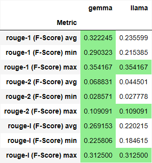
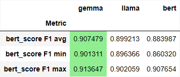
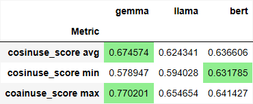

## Исследовательский анализ данных

Мы провели **исследовательский анализ данных** на основе датасета *PubMed*.

### 1. На каких языках написаны статьи?

Мы обработали весь зарубежный датасет _PubMed_ с помощью функции ___nltk.tokenize.sent_tokenize___, которая разделила датасет на логические предложения. Затем мы выявили наиболее доминирующие кластеры языков с помощью ___langdetect.detect_langs___. Полученные кластеры языков были визуализированы, и мы получили график распространённости:

По графику мы пришли к выводу:

> *PubMed — это зарубежный источник информации*. Люди публикуют на международном языке (английском), так как он создан с поддержкой *Национальной медицинской библиотеки США*. Исходя из этого, видно, что очень много литературы написано на английском языке. Также это международная библиотека, в которую можно выставить статью без каких-либо ограничений на народности и национальность, поэтому мы видим такой разброс языков от *чешского* до *немецкого и французского*.

---

### 2. Какие тематики можно выделить?

Для нахождения тематик мы решили разделить текст на кластеры. Однако после тестов *ни одна модель* не смогла нормально разделить и различить эти кластеры. В итоге мы решили взять статьи, разбить их на вектора с помощью ___sklearn.feature_extraction.text.TfidfVectorizer___ и сравнить вектора статей с векторами тем, используя косинусное сходство ___sklearn.metrics.pairwise.cosine_similarity___. Затем мы отсортировали сходства и выбрали 10 самых лучших, получив следующий график:

> На графике видно очень **сильное разделение и разнообразие тем**. Больше всего тем по системам и контролю, а также по тканям и органам. PubMed нацелен на биомедицинские исследования, из этого и следует, что в нём находится очень много публикаций про *ткани и органы*, а также обработку больших данных в сфере *биомедицины*.

---

### 3. Какие проблемы есть в данных?

В данном датасете достаточно много проблем:

1. **Неправильное написание знаков препинания**: Пробелы перед запятыми и точками (например, **пробел запятая пробел** и **пробел точка пробел**) мешают корректному определению смысловых предложений с помощью ___nltk.sentence___.

2. **Пустые строки**: Это одна из самых неприятных проблем в датасетах. Пустые строки могут приводить к ошибкам, когда вы пытаетесь пройтись по датасету, вызывая ошибку **обращение к несуществующему объекту**.

3. **Переносы строк (`\n`)**: Эта часть данных также требует внимания. Переносы строк используются не по назначению и могут стоять в начале текста, что приводит к хаосу в данных.

---

### 4. Сравнить не менее 2х моделей машшиного обучения для формирования резюме статьи на метриках качества резюмирования и обосновать их.

   1. **Rouge**
     
      **ROUGE**, расшифровывается как Recall-Oriented Understudy for Gisting Evaluation, оценивает совпадение слов между сгенерированным результатом и эталонным текстом. Это распространенная метрика для оценки задач автоматического резюмирования. Среди ее разновидностей есть ROUGE-L, которая позволяет определить, насколько хорошо система сохраняет суть оригинального резюме, - это самое длинное непрерывное совпадение между сгенерированным системой и эталонным резюме.

      

      > В таблице показаны средние максимальные и минимальные оценки ROUGE для 10 различных резюме по сравнению с эталонным текстом. В случае с rouge-1 резюме **Bert** превосходит, что свидетельствует о лучшем совпадении отдельных слов, следующим идёт **gemma-2-9b-it-Q6_K_L**, а последним **llama-3.2-3B-Q6_K_L**, и в случае с rouge-l резюме **Bert** имеет более высокий балл, что означает более тесное совпадение по самым длинным общим подпоследовательностям и, таким образом, потенциально лучшее общее обобщение, передающее основное содержание и порядок оригинального текста, за ним идёт **gemma-2-9b-it-Q6_K_L**, а последним **llama-3.2-3B-Q6_K_L**.
      
      > Хотя ROUGE и аналогичные метрики, такие как BLEU и METEOR, __предлагают количественные показатели, они часто не отражают истинную суть хорошо составленного резюме.__ Кроме того, они хуже коррелируют с человеческими оценками. Учитывая развитие LLM, которые умеют создавать беглые и связные резюме, традиционные метрики, такие как ROUGE, могут невольно занижать баллы для этих моделей. Это особенно верно, если резюме сформулированы по-разному, но при этом точно отражают основную информацию.

   2. **bert-score**
      **ROUGE** опирается на точное присутствие слов в предсказанных и эталонных текстах, не умея интерпретировать лежащую в их основе семантику. ___Именно здесь на помощь приходит BERTScore, который использует контекстуальные эмбеддинги модели BERT, стремясь оценить сходство между предсказанным и эталонным предложением в контексте текста, созданного машиной.___
      Сравнивая эмбеддинги из обоих предложений, BERTScore улавливает семантическое сходство, которое может быть упущено традиционными метриками, основанными на n-граммах.
      
      

      > Близкие показатели F1 между резюме указывают на то, что они могут одинаково эффективно отражать ключевую информацию. Однако эту небольшую разницу следует интерпретировать с осторожностью. Поскольку **BERTScore** может не полностью улавливать тонкости и высокоуровневые понятия, которые может понять человек, опирающийся на эту метрику, ___может привести к неправильной интерпретации фактического качества и нюансов резюме.___

   3. **Мы также решили сделать немного пользовательскую метрику, основанную на косинусовом сходстве.**

      
      > Она показывает, какая разница между векторными представлениями человеческого саммари и машинного. На основе этих данных можно понять насколько хорошо сжимает текст генеративный искусственный интеллект по сравнению с людьми.
