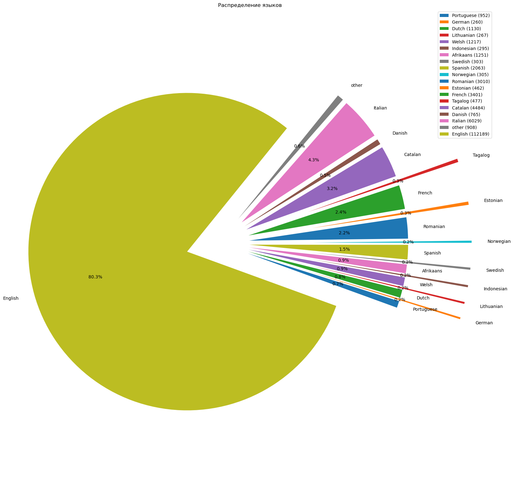
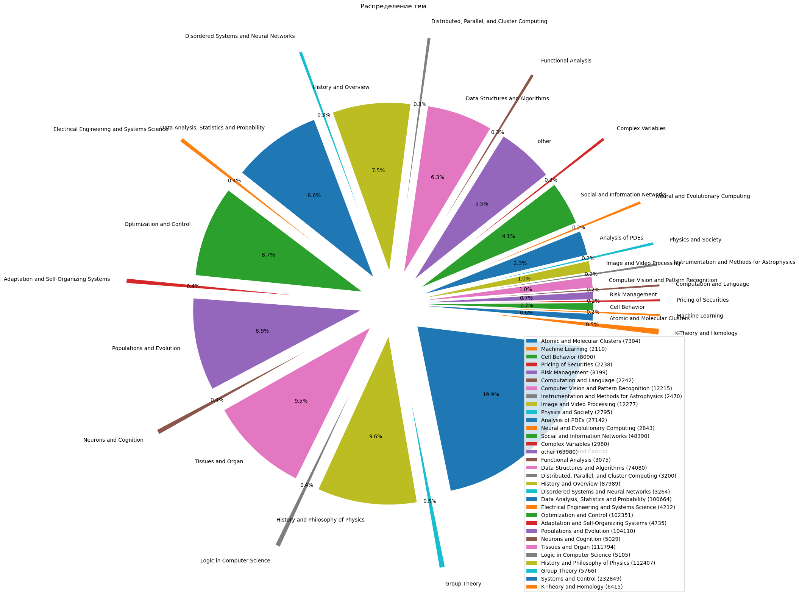

## Исселдовательский анализ данных

   Мы провели **исселдовательский анализ данных** на основе датасета *PubMed*.

1. ### На каких языках написаны статьи?
    Мы пропустили весь зрубежный датасет _PubMed_ через ___nltk.tokenize.sent_tokenize___, который разделил датасет на логические предложения, а потом выявили наиболее доминирующие кластеры языков с помощью ___langdetect.detect_langs___, потом получившиеся кластеры языков мы визуализировали и получили график распространённости:

    

    По графику мы пришли к выводу:
    
>*PubMed-это зарубежный источник информации*, люди публикают на международном языке(английском), так же она создана с поддержкой *Национальной медицинской библиотекк США*. Имходя из этого видно, что очень много литературы написанной на английском языке. Также это международная библиотека, в которою можно выставить статью без каких-либо ограничений на народности и национальность, поэтому мы видим такой разброс языков от *Чешского* до *Немецкого и Французского*.


2. ### Какие тематикиможно выделить?

    Для нахождения тематик мы думали разделить текст на кластеры, но после тестов *ни одна модель* не смогла нормально разделить и различить эти кластеры, потом мы решили взять статьи разбить их на вектора, с помощью ___sklearn.feature_extraction.text.TfidfVectorizer___ и сравнить вектоа статей с векторами тем, используя косинусовое сходство ___sklearn.metrics.pairwise.cosine_similarity___, потом отсортировать сходства и выбрать 10 самых лучших, получили такой график:

    

>На графике видно очень **сильное разделение и разнообразие тем**, больше всего тем по системам и контролю, а также по тканям и органам. Pubmed нацелен на биомедицинские исследования, из этого и следует, что в нём находяться очень много публикаций про *ткани и органы*, а также обработкой больших данных в сфере *биомедицины*. 
3. ### Какие проблемы есть в данных?
   #### В данном датасете достаточно много проблем:

    1. ```' , '``` и ```' . '```-очень сило мешало не правильное написание запятой и точки, из-за такой        констрикции - **пробел запятая пробел** и **пробел точка пробел** - ___nltk.sentence___ плохо опредилял смысловые     предложения.

    2. ```Пустые строки``` - это самое ужачное в датасетах, пустые строки приводят к ошибкам, когда ты даже не         хочешь их увидеть, чаще всего возникает когда вы захотите пройтись по датасету, но возникнет ошибка         **обращение к несуществующему объекту**

    3. ```\n``` - перенос строки, немало важная часть о которой нужно позаботиться, очень сильно мешает при        анализе и обработки естественного языка. В данном датасете она используется вооьще не по назначению, во многих      строках она стоит в начале всего текста, из-за чего получается полный хаос в данных.
