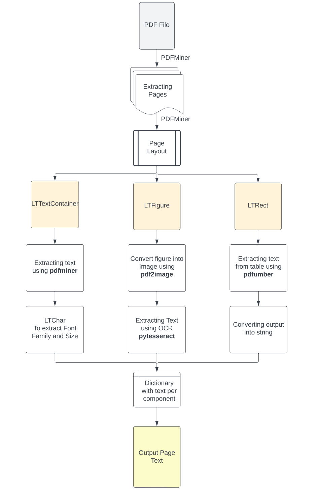

# Web сервис

Мы разработали веб сайт, который резюмирует статью формата pdf и выводит сжатое изложение по ней.
Принцип работы достоаточно прост. На данный момент мы работаем с помощью библиотеки PyPDF2, но мы планируем в будущем сделать полноценный высокоуровневый api для полноценнтого web сервиса с рекомендаиями, потоком, регистрацией и хорошей суммаризацией.
В будущем мы хотим сделать такую структуру обработки pdf файлов:

---
# Demo
Наш текущий веб-сервис.

https://github.com/user-attachments/assets/30f3d1b6-150c-49c4-abb5-efedcf88350f

